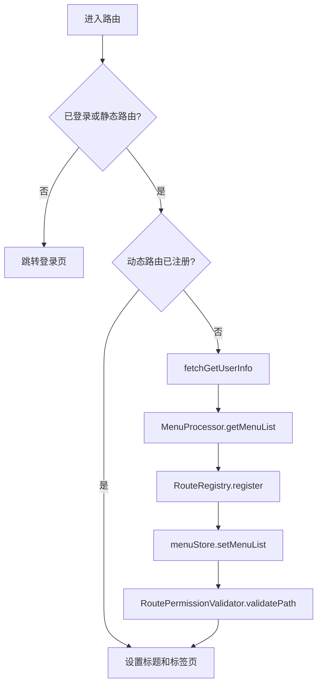

# Art Design Pro Frontend Code Reading

本文用于后续建设 `analysis-room-platform/frontend` 时阅读和改造 Art Design Pro。该模板只作为 Vue3 管理端基础框架，模板演示页面和演示数据不能当成正式业务功能。

- 源仓库：https://github.com/Daymychen/art-design-pro
- 本地阅读目录：`codex-workspace/art-design-pro-temp`
- 正式项目导入目录：`frontend/`
- 技术栈：Vue 3、TypeScript、Vite、Element Plus、Pinia、Vue Router、Axios、ECharts、pnpm

## 1. 前端目录

| 目录 | 作用 | 改造建议 |
| --- | --- | --- |
| `src/api` | API 请求函数，目前只有认证和系统管理示例 | 后续按业务模块拆成 `auth.ts`、`system/user.ts`、`file.ts`、`mailbox.ts` 等 |
| `src/assets` | 静态资源 | 保留，后续放平台图标和业务图片 |
| `src/components` | 业务组件和核心组件 | 优先复用 `art-table`、`art-form`、`art-search-bar`、`art-excel-import/export`、布局组件 |
| `src/config` | 应用配置 | 对接平台名称、首页路径、布局配置 |
| `src/directives` | 权限、角色、按钮等指令 | 必须对接后端返回的按钮权限，不只隐藏按钮 |
| `src/enums` | 枚举 | 可扩展业务状态、文件类型、违章类型 |
| `src/hooks` | 组合式逻辑 | 表格、弹窗、权限、上传等可沉淀到 hooks |
| `src/locales` | 国际化 | 第一阶段可以保留中文，后续统一菜单标题 |
| `src/mock` | 模板 mock 数据 | 正式联调后逐步移除 |
| `src/plugins` | 插件注册 | 保留 Element Plus、全局组件等 |
| `src/router` | 静态路由、动态路由、路由守卫、路由注册核心 | 重点改造为后端菜单驱动 |
| `src/store` | Pinia 状态 | 保留用户、菜单、设置、工作标签页 |
| `src/types` | 全局类型 | 后续按后端 DTO 同步 API 类型 |
| `src/utils` | HTTP、路由、存储、UI、工具函数 | HTTP 封装需要对齐后端响应格式 |
| `src/views` | 页面 | 模板演示页面逐步替换为综合分析室业务页面 |

## 2. package.json 要点

| 项 | 值 |
| --- | --- |
| Node | `>=20.19.0` |
| pnpm | `>=8.8.0` |
| 开发 | `pnpm dev` |
| 构建 | `pnpm build`，内部执行 `vue-tsc --noEmit && vite build` |
| 预览 | `pnpm serve` |
| Lint | `pnpm lint`、`pnpm fix` |
| 格式化 | `pnpm lint:prettier`、`pnpm lint:stylelint` |
| 清理演示 | `pnpm clean:dev`，本项目不要在未确认删除范围前自动执行 |

## 3. HTTP 请求封装

文件：`src/utils/http/index.ts`

核心行为：

| 能力 | 当前实现 | 对接后端时要改 |
| --- | --- | --- |
| Axios 实例 | `baseURL = VITE_API_URL`，超时 15 秒 | `.env` 中指向后端网关或 Spring Boot 地址 |
| Token 注入 | 从 `useUserStore().accessToken` 读取，设置 `Authorization` 请求头 | RuoYi 默认 token 头可按后端约定调整，例如 `Authorization: Bearer <token>` 或直接 token |
| JSON 提交 | POST/PUT 自动把 `params` 迁移到 `data` | 和后端 DTO 保持一致 |
| 响应格式 | 读取 `response.data.code/msg/data`，成功码来自 `ApiStatus.success` | 后端统一响应建议为 `{ code, msg, data }` |
| 401 处理 | 弹错、延迟登出、跳转登录 | 后端 Token 过期时必须统一返回 401 或业务未登录码 |
| 错误提示 | `showError` 统一提示 | 导入/导出、下载接口需特殊处理 blob |

建议后端响应格式：

```json
{
  "code": 200,
  "msg": "操作成功",
  "data": {}
}
```

分页响应建议：

```json
{
  "code": 200,
  "msg": "查询成功",
  "data": {
    "records": [],
    "current": 1,
    "size": 10,
    "total": 0
  }
}
```

如果后端沿用 RuoYi 的 `TableDataInfo`，前端应在 API 层做适配：

```ts
type RuoyiTableData<T> = {
  rows: T[]
  total: number
  code: number
  msg: string
}
```

## 4. 认证 API

文件：`src/api/auth.ts`

| 函数 | HTTP | 模板路径 | 当前用途 | 后端建议路径 |
| --- | --- | --- | --- | --- |
| `fetchLogin(params)` | POST | `/api/auth/login` | 用户登录 | `/auth/login` 或 `/api/auth/login` |
| `fetchGetUserInfo()` | GET | `/api/user/info` | 获取当前用户、角色、按钮权限 | `/system/user/getInfo` 或 `/auth/me` |

模板类型：`src/types/api/api.d.ts`

| 类型 | 字段 | 对接建议 |
| --- | --- | --- |
| `Api.Auth.LoginParams` | `userName`、`password` | 可改为 `username`/`password`，和后端 DTO 保持一致 |
| `Api.Auth.LoginResponse` | `token`、`refreshToken` | 如果后端返回 `accessToken`，前端适配为 `token` 或修改 Store |
| `Api.Auth.UserInfo` | `buttons`、`roles`、`userId`、`userName`、`email`、`avatar` | 后端必须返回按钮权限数组和角色数组 |

## 5. 系统管理 API

文件：`src/api/system-manage.ts`

| 函数 | HTTP | 模板路径 | 当前用途 | 对接 RuoYi 参考 |
| --- | --- | --- | --- | --- |
| `fetchGetUserList(params)` | GET | `/api/user/list` | 用户列表 | `/system/user/list` |
| `fetchGetRoleList(params)` | GET | `/api/role/list` | 角色列表 | `/system/role/list` |
| `fetchGetMenuList()` | GET | `/api/v3/system/menus` | 菜单列表/动态路由 | `/system/menu/getRouters` 或自定义 `/system/menu/routes` |

正式项目建议拆分：

```text
src/api/
  auth.ts
  system/
    user.ts
    role.ts
    dept.ts
    menu.ts
    dict.ts
    log.ts
  file.ts
  mailbox.ts
  todo.ts
  chat.ts
  violation.ts
  lkj.ts
```

## 6. 路由和菜单

关键文件：

| 文件 | 作用 |
| --- | --- |
| `src/router/routes/staticRoutes.ts` | 登录、注册、忘记密码、403、404、500、iframe 等无需动态权限的静态路由 |
| `src/router/routes/asyncRoutes.ts` | 动态路由入口，当前直接引用本地 `routeModules` |
| `src/router/modules/*.ts` | 模板内置菜单模块 |
| `src/router/guards/beforeEach.ts` | 登录态校验、用户信息拉取、菜单拉取、动态路由注册、权限路径校验 |
| `src/router/core` | 路由注册、菜单处理、iframe 管理、权限验证 |

路由守卫流程：



后续对接后端菜单时，后端应返回接近以下结构：

```ts
type PlatformRoute = {
  path: string
  name: string
  component: string
  meta: {
    title: string
    icon?: string
    roles?: string[]
    authList?: { title: string; authMark: string }[]
    keepAlive?: boolean
    isHide?: boolean
  }
  children?: PlatformRoute[]
}
```

## 7. 当前路由模块清单

这些路由来自模板，大部分是演示页面，后续要替换为综合分析室业务菜单。

| 文件 | 主要路由 | 用途 | 改造建议 |
| --- | --- | --- | --- |
| `dashboard.ts` | `/dashboard/console`、`/dashboard/analysis`、`/dashboard/ecommerce` | 仪表盘示例 | 改成“极简功能首页”和“统计分析” |
| `system.ts` | `/system/user`、`/system/role`、`/system/menu`、嵌套路由示例 | 系统管理示例 | 保留为系统管理雏形，接后端真实 API |
| `examples.ts` | 权限、按钮、表格、表单、WebSocket 聊天示例 | 能力演示 | 按需摘取，不保留到正式菜单 |
| `template.ts` | 卡片、Banner、图表、地图、聊天、日历、价格页 | 页面模板 | 聊天、图表、地图可参考 UI 组件 |
| `widgets.ts` | 图标、图片裁剪、Excel、视频、编辑器、二维码等 | 小组件示例 | 文件中心、LKJ 视频、公示导入导出可参考 |
| `article.ts` | 文章列表、详情、评论、发布 | 内容管理示例 | 可作为信箱/公告页面结构参考 |
| `result.ts` | 成功/失败页 | 结果页 | 保留 |
| `exception.ts` | 403/404/500 | 异常页 | 保留 |
| `safeguard.ts` | 服务保障页 | 演示 | 后置 |
| `help.ts` | 外部文档/变更日志 | 帮助链接 | 可改为系统帮助/操作手册 |

建议正式菜单：

```text
/
  dashboard              极简功能首页
  mailbox                信箱中心
  todo                   待办中心
  file                   文件中心
  chat                   聊天协同
  violation              违章管理
  lkj                    每日 LKJ 音视频违标公示
  base-data              基础数据
  system                 系统管理
  analytics              统计分析
```

## 8. Pinia 状态模块

| 文件 | Store | 当前作用 | 后续保留/改造 |
| --- | --- | --- | --- |
| `src/store/modules/user.ts` | `userStore` | 登录状态、用户信息、accessToken、refreshToken、语言、锁屏、搜索历史、登出 | 必须保留；对接后端登录和用户信息 |
| `src/store/modules/menu.ts` | `menuStore` | 菜单列表、首页路径、菜单宽度、动态路由移除函数 | 必须保留；菜单由后端返回 |
| `src/store/modules/setting.ts` | `settingStore` | 主题、布局、进度条、动画、页面配置 | 保留，平台默认走安静、工作型布局 |
| `src/store/modules/table.ts` | `tableStore` | 表格配置 | 保留，用于各业务列表 |
| `src/store/modules/worktab.ts` | `worktabStore` | 标签页、keep-alive 缓存 | 保留 |

用户 Store 关键字段：

| 字段 | 含义 | 对接建议 |
| --- | --- | --- |
| `isLogin` | 登录态 | 登录成功后设置 `true` |
| `accessToken` | 访问 token | HTTP 拦截器读取 |
| `refreshToken` | 刷新 token | 后端若不支持可暂时为空 |
| `info` | 当前用户信息 | 必须包含 `userId`、`userName`、`roles`、`buttons` |

## 9. 权限指令

目录：`src/directives`

| 能力 | 作用 | 对接建议 |
| --- | --- | --- |
| `auth` | 按按钮权限控制元素显示 | 权限来源于后端 `buttons` 或菜单按钮权限 |
| `roles` | 按角色控制元素显示 | 角色来源于后端 `roles` |
| 业务指令 | 高亮、水波纹等 | 非核心，可保留 |

注意：前端权限指令只负责用户体验，后端接口仍必须使用权限注解或拦截器校验。

## 10. 组件参考

| 组件目录 | 可复用能力 | 对应平台模块 |
| --- | --- | --- |
| `components/core/tables/art-table` | 表格封装 | 用户、角色、文件、违章、LKJ 公示列表 |
| `components/core/forms/art-search-bar` | 搜索栏 | 所有列表页 |
| `components/core/forms/art-form` | 表单 | 新增/编辑弹窗 |
| `components/core/forms/art-excel-import` | Excel 导入 | 用户、基础数据、LKJ 公示 |
| `components/core/forms/art-excel-export` | Excel 导出 | 日志、统计、公示、用户 |
| `components/core/layouts/art-chat-window` | 聊天窗口 | 聊天协同 |
| `components/core/layouts/art-notification` | 通知 | 信箱/待办提醒 |
| `components/core/layouts/art-work-tab` | 工作标签页 | 多页面工作流 |
| `components/core/media/art-video-player` | 视频播放 | LKJ 音视频违标公示 |
| `components/core/media/art-cutter-img` | 图片裁剪 | 头像、图片附件 |
| `components/core/charts/*` | 图表 | 统计分析、首页指标 |
| `components/core/cards/*` | 指标卡 | 首页轻量指标 |

## 11. 现有页面改造建议

| 模板页面 | 当前用途 | 改造方向 |
| --- | --- | --- |
| `views/auth/login` | 登录页 | 保留，替换平台名称、登录 API、错误提示 |
| `views/system/user` | 用户列表演示 | 改接 `/system/user/*`，完善部门树、导入导出、重置密码、分配角色 |
| `views/system/role` | 角色列表演示 | 改接 `/system/role/*`，补菜单授权和数据权限 |
| `views/system/menu` | 菜单列表演示 | 改接 `/system/menu/*`，补目录/菜单/按钮类型 |
| `views/dashboard/console` | 控制台 | 改为极简功能首页 |
| `views/dashboard/analysis` | 分析看板 | 改为统计分析 |
| `views/template/chat` | 聊天模板 | 参考聊天协同 UI |
| `views/widgets/excel` | Excel 示例 | 参考导入导出组件 |
| `views/widgets/video` | 视频示例 | 参考 LKJ 视频播放 |
| `views/examples/socket-chat` | WebSocket 示例 | 参考实时聊天，但正式接口需重写 |

## 12. 前端 API 类型规范

建议每个业务模块都定义：

```ts
export namespace Api.SystemUser {
  export interface Query {
    pageNum: number
    pageSize: number
    userName?: string
    phonenumber?: string
    status?: string
    deptId?: number
  }

  export interface Item {
    userId: number
    userName: string
    nickName: string
    deptId?: number
    status: string
  }
}
```

命名规则：

| 类型 | 命名 |
| --- | --- |
| 查询参数 | `XxxQuery` |
| 新增参数 | `XxxCreateReq` |
| 编辑参数 | `XxxUpdateReq` |
| 列表项 | `XxxListItem` |
| 详情 | `XxxDetail` |
| 分页响应 | `PageResult<XxxListItem>` |

## 13. UI 设计原则

综合分析室平台是工作型后台，不做营销化首页。

| 区域 | 设计建议 |
| --- | --- |
| 顶部 | 保留工作台标签、全局搜索、通知、用户菜单 |
| 侧边栏 | 模块清晰、层级不超过 3 层；第一层为核心业务模块 |
| 首页 | 紧凑功能入口、待办摘要、信箱摘要、LKJ 公示摘要、违章统计 |
| 列表页 | 搜索条件 + 工具栏 + 表格 + 分页；批量操作放工具栏 |
| 表单 | 新增/编辑优先用抽屉或弹窗，避免跳转过深 |
| 详情页 | 右侧抽屉或独立详情页，展示日志、附件、流转记录 |
| 图表 | 统计分析页使用，首页只放少量核心指标 |
| 权限 | 无权限按钮隐藏，但接口必须返回 403 或无权限业务码 |

## 14. 后续 Codex 阅读规则

后续让 Codex 改前端时，建议明确说：

```text
请参考 frontend 中 Art Design Pro 的路由、Store、HTTP 封装和组件结构。
不要保留模板演示数据作为正式业务功能。
新增页面优先复用 art-table、art-search-bar、art-form、权限指令和 Pinia Store。
```

每做一个页面前先对照：

1. 该页面是否有后端接口和权限码。
2. 该页面是否需要数据权限提示或部门筛选。
3. 该页面是否需要导入、导出、上传、下载。
4. 该页面是否是列表/详情/弹窗/抽屉四类之一。
