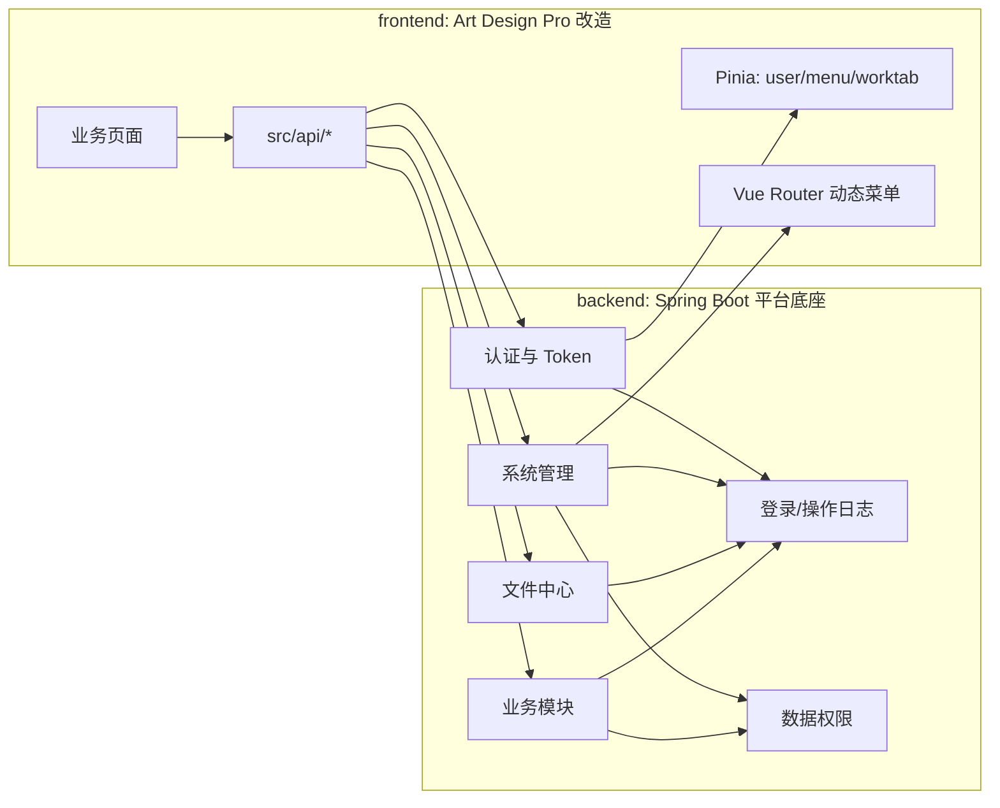
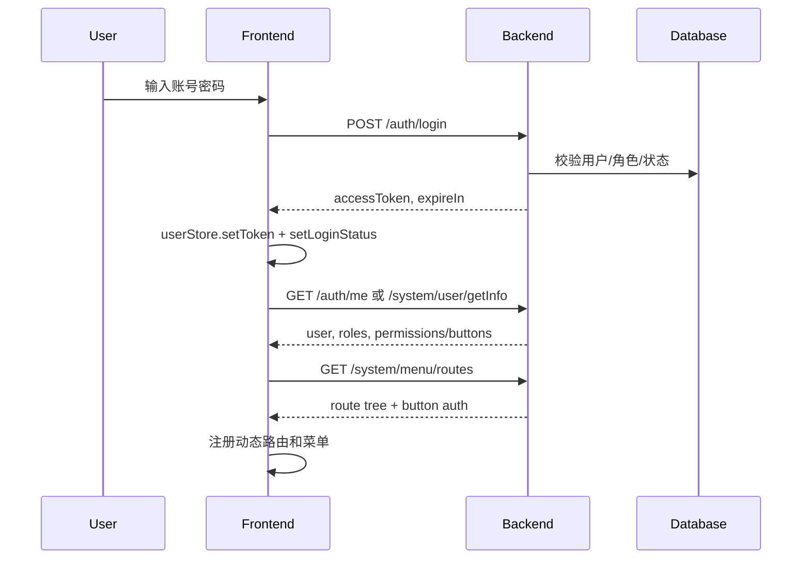

# Fullstack Connection And Build Flow

本文说明如何把 RuoYi-Vue-Plus 的后端设计思想和 Art Design Pro 的前端模板连接起来，形成 `analysis-room-platform` 的全栈平台搭建流程。

目标不是把两个开源项目拼在一起，而是：

1. 后端参考 RuoYi-Vue-Plus 的权限、安全、日志、数据权限、Excel、文件存储、代码生成器设计。
2. 前端使用 Art Design Pro 的 Vue3 管理端框架、路由、菜单、表格、表单、状态管理和布局能力。
3. 正式业务代码按综合分析室平台重新建模。

## 1. 总体架构



推荐部署形态：

| 阶段 | 前端 | 后端 | 数据库 | 文件 |
| --- | --- | --- | --- | --- |
| 本地开发 | Vite dev server | Spring Boot | MySQL/PostgreSQL | 本地磁盘或 MinIO |
| 测试环境 | Nginx 静态资源 | Spring Boot jar/container | MySQL/PostgreSQL | MinIO |
| 生产环境 | Nginx/CDN | Spring Boot 服务 | 主备数据库 | MinIO/对象存储 |

## 2. 统一接口约定

### 2.1 基础响应

前端 `src/utils/http/index.ts` 已按 `{ code, msg, data }` 处理响应，因此后端统一返回：

```json
{
  "code": 200,
  "msg": "操作成功",
  "data": {}
}
```

建议状态码：

| code | 含义 | 前端行为 |
| --- | --- | --- |
| `200` | 成功 | 返回 `data` |
| `400` | 参数错误 | 展示错误 |
| `401` | 未登录或 Token 过期 | 清空登录态并跳转登录 |
| `403` | 无权限 | 展示无权限或跳转 403 |
| `500` | 服务异常 | 展示错误 |

### 2.2 分页响应

推荐前端使用统一分页：

```json
{
  "code": 200,
  "msg": "查询成功",
  "data": {
    "records": [],
    "total": 0,
    "current": 1,
    "size": 10
  }
}
```

如果后端复刻 RuoYi 的 `TableDataInfo` 返回 `rows/total`，应在前端 API 层做适配，不要让页面到处判断两种格式。

### 2.3 Token 请求头

建议统一：

```text
Authorization: Bearer <accessToken>
```

如果后端参考 RuoYi 的 Sa-Token 默认头名，也可以在 HTTP 拦截器中统一转换。不要让各 API 函数手写 Token。

## 3. 登录、用户信息、菜单连接



推荐接口：

| 前端动作 | 前端函数 | 后端接口 | 后端参考 |
| --- | --- | --- | --- |
| 登录 | `fetchLogin` | `POST /auth/login` | `AuthController.login` |
| 退出 | `logout` | `POST /auth/logout` | `AuthController.logout` |
| 当前用户 | `fetchGetUserInfo` | `GET /auth/me` 或 `GET /system/user/getInfo` | `SysUserController.getInfo()` |
| 当前菜单 | `fetchGetMenuList` | `GET /system/menu/routes` 或 `/system/menu/getRouters` | `SysMenuController.getRouters` |
| 验证码 | `fetchCaptcha` | `GET /auth/code` | `CaptchaController.getCode` |

后端返回的当前用户建议格式：

```json
{
  "userId": 1,
  "userName": "admin",
  "nickName": "管理员",
  "avatar": "",
  "deptId": 103,
  "roles": ["admin"],
  "buttons": [
    "system:user:list",
    "system:user:add",
    "system:user:edit"
  ]
}
```

后端返回的路由建议格式：

```json
[
  {
    "path": "/system",
    "name": "System",
    "component": "/index/index",
    "meta": {
      "title": "系统管理",
      "icon": "ri:settings-3-line"
    },
    "children": [
      {
        "path": "user",
        "name": "SystemUser",
        "component": "/system/user",
        "meta": {
          "title": "用户管理",
          "authList": [
            { "title": "新增", "authMark": "system:user:add" },
            { "title": "编辑", "authMark": "system:user:edit" }
          ]
        }
      }
    ]
  }
]
```

## 4. 模块到前后端映射

| 平台模块 | 前端路由 | 前端 API 文件 | 后端模块 | 后端接口前缀 | 权限前缀 | 数据表 |
| --- | --- | --- | --- | --- | --- | --- |
| 极简功能首页 | `/dashboard` | `dashboard.ts` | system + business summary | `/dashboard/*` | `dashboard:*` | 聚合查询 |
| 信箱中心 | `/mailbox` | `mailbox.ts` | `analysis-mailbox` | `/mailbox/*` | `mailbox:*` | `mail_message`、`mail_receiver` |
| 待办中心 | `/todo` | `todo.ts` | `analysis-todo` | `/todo/*` | `todo:*` | `todo_item` |
| 文件中心 | `/file` | `file.ts` | `analysis-file` | `/file/*` 或 `/resource/oss/*` | `file:*` 或 `system:oss:*` | `sys_oss`、`file_folder` |
| 聊天协同 | `/chat` | `chat.ts` | `analysis-chat` | `/chat/*`、`/ws/chat` | `chat:*` | `chat_room`、`chat_message` |
| 违章管理 | `/violation` | `violation.ts` | `analysis-violation` | `/violation/*` | `violation:*` | `violation_record` |
| 每日 LKJ 音视频违标公示 | `/lkj/daily-publicity` | `lkj.ts` | `analysis-lkj` | `/lkj/publicity/*` | `lkj:publicity:*` | `lkj_publicity`、`lkj_publicity_file` |
| 基础数据 | `/base-data` | `base-data.ts` | `analysis-base-data` | `/base-data/*` | `base:*` | 站段、车间、班组、人员等 |
| 系统管理 | `/system` | `system/*.ts` | `analysis-system` | `/system/*` | `system:*` | `sys_user`、`sys_role`、`sys_menu`、`sys_dept` |
| 统计分析 | `/analytics` | `analytics.ts` | 聚合查询 | `/analytics/*` | `analytics:*` | 聚合查询/宽表 |

## 5. 第一阶段接口清单

### 5.1 系统管理

| 页面 | 后端接口 | 权限码 | 说明 |
| --- | --- | --- | --- |
| 用户列表 | `GET /system/user/list` | `system:user:list` | 分页、部门筛选、状态筛选 |
| 用户详情 | `GET /system/user/{userId}` | `system:user:query` | 编辑前加载 |
| 新增用户 | `POST /system/user` | `system:user:add` | 写操作记录日志 |
| 编辑用户 | `PUT /system/user` | `system:user:edit` | 写操作记录日志 |
| 删除用户 | `DELETE /system/user/{userIds}` | `system:user:remove` | 禁止删除当前用户 |
| 重置密码 | `PUT /system/user/resetPwd` | `system:user:resetPwd` | 写操作记录日志 |
| 启停用户 | `PUT /system/user/changeStatus` | `system:user:edit` | 写操作记录日志 |
| 导入用户 | `POST /system/user/importData` | `system:user:import` | Excel |
| 导出用户 | `POST /system/user/export` | `system:user:export` | Excel |
| 角色列表 | `GET /system/role/list` | `system:role:list` | 分页 |
| 新增角色 | `POST /system/role` | `system:role:add` | 写操作记录日志 |
| 编辑角色 | `PUT /system/role` | `system:role:edit` | 写操作记录日志 |
| 删除角色 | `DELETE /system/role/{roleIds}` | `system:role:remove` | 写操作记录日志 |
| 数据权限 | `PUT /system/role/dataScope` | `system:role:edit` | 绑定 `sys_role_dept` |
| 菜单树 | `GET /system/menu/treeselect` | `system:menu:query` | 角色授权使用 |
| 角色菜单树 | `GET /system/menu/roleMenuTreeselect/{roleId}` | `system:menu:query` | 编辑角色授权 |
| 部门列表 | `GET /system/dept/list` | `system:dept:list` | 树形 |
| 新增部门 | `POST /system/dept` | `system:dept:add` | 写操作记录日志 |
| 编辑部门 | `PUT /system/dept` | `system:dept:edit` | 写操作记录日志 |
| 删除部门 | `DELETE /system/dept/{deptId}` | `system:dept:remove` | 有子部门或用户时禁止 |

### 5.2 日志

| 页面 | 后端接口 | 权限码 | 说明 |
| --- | --- | --- | --- |
| 登录日志 | `GET /monitor/logininfor/list` | `monitor:logininfor:list` | 查询登录记录 |
| 导出登录日志 | `POST /monitor/logininfor/export` | `monitor:logininfor:export` | Excel |
| 删除登录日志 | `DELETE /monitor/logininfor/{infoIds}` | `monitor:logininfor:remove` | 写日志 |
| 清空登录日志 | `DELETE /monitor/logininfor/clean` | `monitor:logininfor:remove` | 高危操作 |
| 操作日志 | `GET /monitor/operlog/list` | `monitor:operlog:list` | 查询操作记录 |
| 导出操作日志 | `POST /monitor/operlog/export` | `monitor:operlog:export` | Excel |
| 删除操作日志 | `DELETE /monitor/operlog/{operIds}` | `monitor:operlog:remove` | 写日志 |
| 清空操作日志 | `DELETE /monitor/operlog/clean` | `monitor:operlog:remove` | 高危操作 |

### 5.3 文件中心

| 页面 | 后端接口 | 权限码 | 说明 |
| --- | --- | --- | --- |
| 文件列表 | `GET /file/list` 或 `/resource/oss/list` | `file:list` | 支持名称、类型、上传人、时间筛选 |
| 文件上传 | `POST /file/upload` 或 `/resource/oss/upload` | `file:upload` | Multipart |
| 文件下载 | `GET /file/download/{fileId}` | `file:download` | 流式下载 |
| 文件删除 | `DELETE /file/{fileIds}` | `file:remove` | 同步删除元数据和对象 |
| 文件详情 | `GET /file/{fileId}` | `file:query` | 附件预览 |

### 5.4 每日 LKJ 音视频违标公示

| 页面 | 后端接口 | 权限码 | 说明 |
| --- | --- | --- | --- |
| 公示列表 | `GET /lkj/publicity/list` | `lkj:publicity:list` | 日期、部门、车次、状态筛选 |
| 公示详情 | `GET /lkj/publicity/{id}` | `lkj:publicity:query` | 视频、截图、处理记录 |
| 新增公示 | `POST /lkj/publicity` | `lkj:publicity:add` | 写日志 |
| 编辑公示 | `PUT /lkj/publicity` | `lkj:publicity:edit` | 写日志 |
| 删除公示 | `DELETE /lkj/publicity/{ids}` | `lkj:publicity:remove` | 写日志 |
| 导入公示 | `POST /lkj/publicity/importData` | `lkj:publicity:import` | Excel |
| 导出公示 | `POST /lkj/publicity/export` | `lkj:publicity:export` | Excel |
| 上传附件 | `POST /lkj/publicity/{id}/files` | `lkj:publicity:file` | 复用文件中心 |
| 发布/撤回 | `PUT /lkj/publicity/{id}/publish` | `lkj:publicity:publish` | 状态流转 |

## 6. UI 设计方案

### 6.1 信息架构

一级菜单建议：

```text
首页
信箱中心
待办中心
文件中心
聊天协同
违章管理
每日 LKJ 音视频违标公示
基础数据
系统管理
统计分析
```

二级菜单建议：

| 一级模块 | 二级页面 |
| --- | --- |
| 首页 | 工作概览 |
| 信箱中心 | 收件箱、发件箱、草稿箱、通知公告 |
| 待办中心 | 我的待办、我发起的、已完成、待办规则 |
| 文件中心 | 文件列表、文件分类、回收站 |
| 聊天协同 | 会话列表、群组、消息检索 |
| 违章管理 | 违章台账、违章审核、整改跟踪 |
| 每日 LKJ 音视频违标公示 | 每日公示、导入记录、统计汇总 |
| 基础数据 | 部门、人员、车站/线路/车次等基础表 |
| 系统管理 | 用户、角色、菜单、部门、字典、参数、日志 |
| 统计分析 | 综合看板、趋势分析、部门排名、导出报表 |

### 6.2 页面形态

| 页面类型 | 结构 | 组件 |
| --- | --- | --- |
| 列表页 | 搜索区、工具栏、表格、分页 | `art-search-bar`、`art-table`、Element Plus buttons |
| 编辑页 | 弹窗或抽屉表单 | `art-form`、`el-dialog`、`el-drawer` |
| 详情页 | 基本信息、附件、日志、处理记录 | `el-descriptions`、`art-video-player`、时间线 |
| 统计页 | 指标条、筛选器、图表、明细表 | `art-stats-card`、ECharts 组件 |
| 上传页 | 上传区、导入模板、导入结果 | `el-upload`、`art-excel-import` |
| 聊天页 | 会话侧栏、消息列表、输入区 | `art-chat-window`，后端接 WebSocket |

### 6.3 视觉风格

原则：安静、工作型、信息密度适中。

1. 首页不做营销大图，第一屏直接给功能入口和待办摘要。
2. 列表页默认紧凑，搜索项不超过两行，更多条件折叠。
3. 图表只在统计分析和首页摘要使用，避免所有页面卡片化。
4. 状态颜色固定：成功绿、警告橙、错误红、处理中蓝、禁用灰。
5. 文件、视频、音频、Excel 等操作使用明确图标按钮和 tooltip。

## 7. 后端代码搭建流程

### 7.1 建议目录

```text
backend/
  pom.xml
  analysis-admin/
    src/main/java/.../AnalysisApplication.java
  analysis-common/
    common-core/
    common-web/
    common-security/
    common-mybatis/
    common-log/
    common-excel/
    common-file/
  analysis-modules/
    analysis-system/
    analysis-file/
    analysis-mailbox/
    analysis-todo/
    analysis-chat/
    analysis-violation/
    analysis-lkj/
```

### 7.2 搭建顺序

1. 创建 Spring Boot 多模块 Maven 项目。
2. 建立 `common-core`：统一响应 `R<T>`、分页对象、异常、常量、工具类。
3. 建立 `common-web`：全局异常、参数校验、CORS、请求上下文。
4. 建立 `common-security`：Token 过滤器、登录用户上下文、权限注解或拦截器。
5. 建立 `common-mybatis`：MyBatis Plus、分页、审计字段填充、数据权限拦截。
6. 建立 `common-log`：`@OperationLog` 注解、切面、日志入库。
7. 建立 `common-excel`：导入导出工具。
8. 建立 `common-file`：文件存储接口、本地/MinIO 实现。
9. 建立 `analysis-system`：用户、角色、菜单、部门、字典、参数、日志。
10. 建立业务模块：文件、信箱、待办、聊天、违章、LKJ。

### 7.3 数据库初始化顺序

1. `sys_dept`
2. `sys_user`
3. `sys_role`
4. `sys_menu`
5. `sys_user_role`
6. `sys_role_menu`
7. `sys_role_dept`
8. `sys_oper_log`
9. `sys_logininfor`
10. `sys_oss`
11. 业务表：mailbox、todo、chat、violation、lkj

## 8. 前端代码搭建流程

### 8.1 保留模板能力

保留：

| 能力 | 文件 |
| --- | --- |
| 登录页 | `src/views/auth/login` |
| HTTP 封装 | `src/utils/http` |
| 路由守卫 | `src/router/guards/beforeEach.ts` |
| 动态路由注册 | `src/router/core` |
| 用户 Store | `src/store/modules/user.ts` |
| 菜单 Store | `src/store/modules/menu.ts` |
| 工作标签页 | `src/store/modules/worktab.ts` |
| 表格/表单/Excel/视频/聊天组件 | `src/components/core/*` |

逐步替换：

| 模板内容 | 替换为 |
| --- | --- |
| dashboard demo | 极简功能首页和统计摘要 |
| article demo | 信箱/公告 |
| examples demo | 不进入正式菜单 |
| template demo | 只抽组件/布局 |
| widgets demo | 只抽 Excel、视频、上传等能力 |

### 8.2 改造顺序

1. 配置 `.env.development` 的 `VITE_API_URL`。
2. 调整 `src/api/auth.ts` 对接后端登录、退出、当前用户。
3. 调整 `src/utils/http/index.ts` 的成功码、Token 请求头和 401/403 行为。
4. 调整 `src/store/modules/user.ts` 的 token 字段和用户信息字段。
5. 调整 `src/api/system-manage.ts` 或拆分 `src/api/system/*`。
6. 改造 `src/router/guards/beforeEach.ts` 的菜单拉取逻辑。
7. 用后端菜单替换本地 `routeModules`，保留静态登录和异常页。
8. 落地系统管理页面：用户、角色、菜单、部门。
9. 落地文件中心。
10. 落地业务页面：信箱、待办、聊天、违章、LKJ。

## 9. 联调检查清单

| 检查项 | 要求 |
| --- | --- |
| 登录 | 错误密码返回明确错误；成功后 token 存入 Store |
| 401 | Token 过期能自动退出并回登录页 |
| 403 | 无权限接口返回无权限，前端不崩溃 |
| 菜单 | 后端返回的菜单能动态注册路由 |
| 按钮 | 后端权限码控制按钮显示，接口仍校验 |
| 分页 | 所有列表统一分页格式 |
| 导出 | 文件流下载正常，失败时能解析错误 |
| 上传 | Multipart 文件上传、大小限制、类型限制 |
| 日志 | 登录、写操作、导入、导出、删除、授权都有记录 |
| 数据权限 | 普通用户只能看到自己部门范围数据 |

## 10. 代码生成/开发节奏

建议每个业务模块都按以下切片推进：

1. 建表和实体。
2. 后端列表查询和详情接口。
3. 前端列表页和搜索条件。
4. 后端新增/编辑/删除接口。
5. 前端新增/编辑弹窗。
6. 权限码和菜单按钮入库。
7. 操作日志和数据权限。
8. 导入/导出/附件。
9. 单元测试或接口测试。
10. 文档更新。

不要先铺所有页面空壳。每次选择一个可纵向跑通的模块，例如“用户管理”或“文件中心”，把前端页面、后端接口、权限、日志、数据权限一起跑通。

## 11. 推荐第一批实现顺序

1. 初始化 Spring Boot 后端底座。
2. 对接前端登录和当前用户信息。
3. 对接后端菜单和按钮权限。
4. 用户、角色、部门、菜单。
5. 登录日志、操作日志。
6. 文件中心。
7. Excel 导入导出。
8. 信箱中心和待办中心。
9. 聊天协同。
10. 违章管理。
11. 每日 LKJ 音视频违标公示。
12. 统计分析。

## 12. 给 Codex 的后续任务模板

后续每次开新任务时可这样描述：

```text
请基于 docs/RUOYI_VUE_PLUS_CODE_READING.md、
docs/ART_DESIGN_PRO_CODE_READING.md、
docs/FULLSTACK_CONNECTION_AND_BUILD_FLOW.md，
实现某某模块的一个纵向切片。

要求：
1. 后端接口必须有权限校验、操作日志和必要的数据权限。
2. 前端必须复用现有 HTTP 封装、Pinia、路由和组件约定。
3. 不复制 RuoYi-Vue-Plus 源码。
4. 不把 Art Design Pro 演示数据当正式业务。
```
