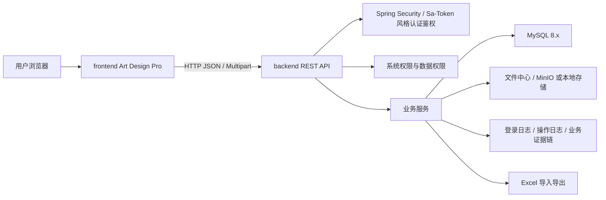
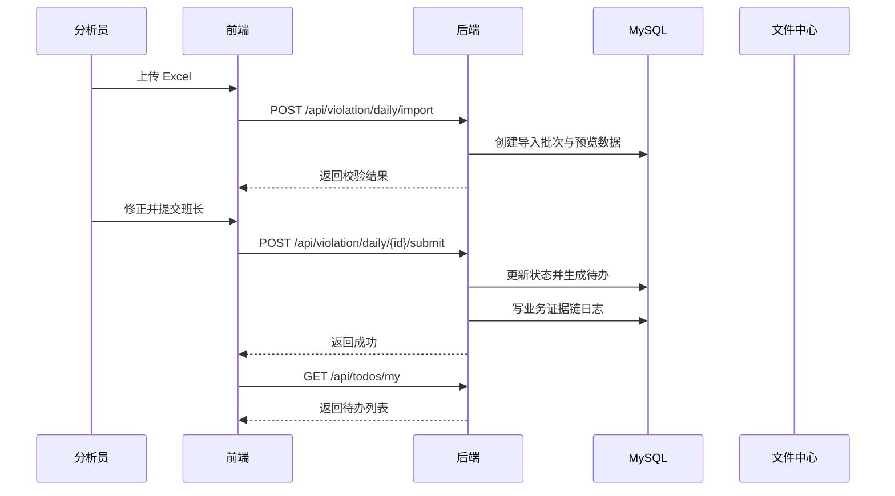

# 全栈平台设计文档

## 目标

本文档定义“综合分析室数据分析平台”的前后端连接方式和 UI 设计方向。第一阶段不追求一次性实现所有模块，只建立可持续扩展的平台底座，并完成“违章管理 > 每日 LKJ 音视频违标公示”样板业务闭环。

前端基础采用 Art Design Pro 的 Vue3、TypeScript、Vite、Element Plus、Pinia、Vue Router、pnpm 工作流。后端采用 Spring Boot、MySQL 8.x，并参考 RuoYi-Vue-Plus 的权限、安全、日志、数据权限、Excel、文件存储和代码生成器设计。

## 总体架构



第一阶段采用单体应用结构：

- 前端：`frontend/`
- 后端：`backend/`
- 数据库脚本：`database/mysql/`
- 项目规范：`docs/`
- 辅助脚本：`scripts/`

不使用微服务，不引入复杂工作流引擎，不启用多租户、多数据源、分布式任务、大规模监控和链路追踪。

## 前后端连接原则

前端只负责体验和显示控制，后端负责真实权限和数据安全。

- 前端根据后端返回的菜单、按钮权限和用户信息动态生成页面入口。
- 后端每个接口都必须校验登录态、功能权限、操作权限和数据权限。
- 前端隐藏按钮不等于有安全控制，所有提交、审核、退回、导出、上传、入库接口必须在后端再次校验。
- 后端返回统一响应结构，前端的 Axios 封装只识别统一错误码、业务码和消息。
- 所有列表查询都必须走后端分页、筛选和数据权限过滤。
- 所有导出都必须后端生成，并记录导出日志。

## API 基础约定

建议后端统一 API 前缀：

```text
/api
```

建议响应结构：

```json
{
  "code": 200,
  "message": "success",
  "data": {},
  "traceId": "optional-request-trace-id"
}
```

分页响应：

```json
{
  "code": 200,
  "message": "success",
  "data": {
    "rows": [],
    "total": 0,
    "pageNum": 1,
    "pageSize": 20
  }
}
```

错误码建议：

```text
200     成功
400     参数错误
401     未登录或登录过期
403     无权限
404     资源不存在
409     状态冲突或重复提交
422     业务校验失败
500     服务端错误
```

前端 Axios 拦截器处理：

- 自动附带 token。
- `401` 清理登录状态并跳转登录页。
- `403` 弹出无权限提示或进入 403 页面。
- `422` 展示业务校验消息，不当作系统异常。
- 下载接口按 blob 处理。

## 认证与权限连接

### 登录接口

```text
POST /api/auth/login
POST /api/auth/logout
GET  /api/auth/profile
GET  /api/auth/menus
GET  /api/auth/permissions
```

登录返回：

```json
{
  "token": "access-token",
  "user": {
    "userId": 1,
    "username": "admin",
    "nickname": "系统管理员",
    "deptId": 100,
    "roles": ["admin"]
  },
  "permissions": ["system:user:list", "violation:daily:list"],
  "menus": []
}
```

### 前端接入点

Art Design Pro 中需要重点改造：

- `src/utils/http/index.ts`：接入真实 API 地址、token、错误码。
- `src/store/modules/user.ts`：保存用户、角色、权限、token。
- `src/store/modules/menu.ts`：接收后端菜单并生成路由。
- `src/router/guards/beforeEach.ts`：登录态、动态路由和页面权限判断。
- `src/directives/core/auth.ts`：按钮权限显示控制。
- `src/directives/core/roles.ts`：角色显示控制。

### 后端权限模型

后端参考 RuoYi-Vue-Plus 的用户、角色、部门、菜单、按钮、角色菜单、角色部门数据权限模型，但在本项目中重新实现。

建议权限标识：

```text
system:user:list
system:user:add
system:user:edit
system:user:remove
system:user:export
violation:daily:list
violation:daily:import
violation:daily:submit
violation:daily:audit
violation:daily:return
violation:daily:dispatch
violation:daily:feedback
violation:daily:finalConfirm
violation:daily:archive
violation:daily:export
file:center:upload
file:center:download
file:center:remove
```

## 菜单与路由设计

第一阶段菜单应先形成平台感，不要只做一个违章页面。

```text
功能首页
信箱中心
待办中心
文件中心
聊天协同
违章管理
  每日 LKJ 音视频违标公示
基础数据
  人员管理
  组织管理
  违标编码字典
  导入导出模板
系统管理
  用户管理
  角色管理
  部门管理
  菜单管理
  登录日志
  操作日志
统计分析
```

菜单来源以后端为准。前端可以保留静态兜底路由，如登录页、403、404、首页框架页。

后端菜单字段建议：

```json
{
  "id": 100,
  "parentId": 0,
  "title": "违章管理",
  "path": "/violation",
  "component": "Layout",
  "type": "DIR",
  "icon": "Warning",
  "sort": 10,
  "visible": true,
  "permission": "",
  "children": []
}
```

## UI 设计方向

平台定位是内部中后台工作台，UI 应当克制、清晰、信息密度适中，避免营销页和装饰化大屏风格。

### 整体布局

- 左侧主菜单 + 顶部操作栏 + 标签页工作区。
- 首页是功能入口和待办概览，不做宣传型 hero。
- 列表页以表格、筛选、批量操作、状态标识为核心。
- 表单页优先使用抽屉或分步表单，减少跳转。
- 审核流页面采用“主表格 + 详情抽屉 + 操作区 + 日志时间线”。

### 首页

极简功能首页建议包含：

- 常用入口：信箱中心、待办中心、每日 LKJ 音视频违标公示、文件中心、基础数据。
- 我的待办：待审核、被退回、待确认、待复核。
- 最近处理：最近提交、最近审核、最近反馈。
- 系统公告：后续可接通知公告。

### 每日 LKJ 音视频违标公示页面

建议页面结构：

```text
顶部筛选区：
  提报日期、违章日期、责任车间、车队、指导组、状态、编码、关键词

主表格：
  批次号、违章日期、车次、司机、违标编码、问题描述、责任部门、状态、当前处理人、更新时间

右侧/抽屉详情：
  基本信息
  编码校验结果
  附件列表
  流转记录
  操作日志

操作区：
  导入、预览、提交、审核通过、退回、下发、反馈不属实、复核、最终确认、导出
```

### 状态设计

业务状态建议：

```text
DRAFT               草稿
IMPORTED            已导入待预览
SUBMITTED           已提交班长
LEADER_APPROVED     班长已审
DIRECTOR_APPROVED   主任已审
DISPATCHED          已下发
TEAM_CONFIRMED      车队已确认
GUIDE_CONFIRMED     指导组已确认
GUIDE_REJECTED      指导组反馈不属实
RETURNED            已退回
RECHECKED           分析室已复核
FINAL_CONFIRMED     主任最终确认
ARCHIVED            已入结果库
```

颜色建议：

- 草稿/待处理：灰色或蓝色。
- 进行中：蓝色。
- 已通过/已入库：绿色。
- 退回/不属实：橙色。
- 异常/失败：红色。

### 表单与导入体验

- Excel 导入必须先进入预览页，不直接入库。
- 编码、性质、类别、类型必须显示校验结果。
- 校验失败行可高亮并显示错误原因。
- 导入后形成批次，批次进入后续审核流。
- 导出按钮必须受独立导出权限控制。

## 后端模块设计

建议后端目录：

```text
backend/
  src/main/java/com/analysisroom/platform/
    AnalysisRoomApplication.java
    common/
      core/
      web/
      security/
      permission/
      log/
      excel/
      file/
      mybatis/
    system/
      user/
      role/
      dept/
      menu/
      loginlog/
      operlog/
    business/
      inbox/
      todo/
      filecenter/
      violation/
        daily/
      evidence/
    base/
      person/
      organization/
      violationcode/
      importtemplate/
    generator/
```

### 公共能力

- `common.security`：登录、token、接口鉴权。
- `common.permission`：权限注解、数据权限上下文。
- `common.log`：操作日志、登录日志、业务证据链日志。
- `common.excel`：导入解析、导出生成、模板下载。
- `common.file`：上传、下载、元数据、存储适配。
- `business.inbox`：信箱中心。
- `business.todo`：待办中心。
- `business.evidence`：业务操作证据链。

## 数据库设计顺序

第一阶段先建立系统底座表，再建立业务表。

系统底座：

- `sys_user`
- `sys_role`
- `sys_dept`
- `sys_menu`
- `sys_user_role`
- `sys_role_menu`
- `sys_role_dept`
- `sys_login_log`
- `sys_oper_log`

公共业务：

- `biz_inbox_message`
- `biz_todo_task`
- `biz_file`
- `biz_file_bind`
- `biz_evidence_log`
- `base_person`
- `base_org`
- `base_violation_code`
- `base_import_template`

每日 LKJ 音视频违标公示：

- `violation_daily_batch`
- `violation_daily_item`
- `violation_daily_flow`
- `violation_daily_result`
- `violation_daily_import_error`

历史数据必须保留快照字段，例如人员名称、组织名称、违标编码名称、编码性质、责任部门名称，不允许只保存外键。

## 第一阶段端到端主流程



## 接口分组建议

系统管理：

```text
/api/system/users
/api/system/roles
/api/system/depts
/api/system/menus
/api/system/login-logs
/api/system/oper-logs
```

公共能力：

```text
/api/inbox/messages
/api/todos
/api/files
/api/excel/templates
```

基础数据：

```text
/api/base/persons
/api/base/orgs
/api/base/violation-codes
```

每日 LKJ 音视频违标公示：

```text
/api/violation/daily/batches
/api/violation/daily/items
/api/violation/daily/import
/api/violation/daily/{id}/submit
/api/violation/daily/{id}/approve
/api/violation/daily/{id}/return
/api/violation/daily/{id}/dispatch
/api/violation/daily/{id}/feedback
/api/violation/daily/{id}/recheck
/api/violation/daily/{id}/final-confirm
/api/violation/daily/{id}/archive
/api/violation/daily/export
```

## 前端页面落地顺序

1. 登录页接真实接口。
2. 菜单与权限接真实接口。
3. 极简功能首页。
4. 系统管理基础页：用户、角色、部门、菜单。
5. 信箱中心、待办中心、文件中心。
6. 基础数据：人员、组织、违标编码。
7. 每日 LKJ 音视频违标公示列表、导入、预览、审核、详情抽屉。
8. 统计分析入口和基础看板。

## 风险与边界

- 不要把 Art Design Pro 的演示页面当成正式业务功能。
- 不要把 RuoYi-Vue-Plus 源码直接复制进项目。
- 不要先做复杂工作流引擎；第一阶段用明确状态机和业务流转表。
- 不要只做前端权限；后端必须兜底。
- 不要直接入库导入数据；必须先预览和校验。
- 不要物理删除历史业务数据。
- 不要覆盖历史编码、人员、组织快照。
