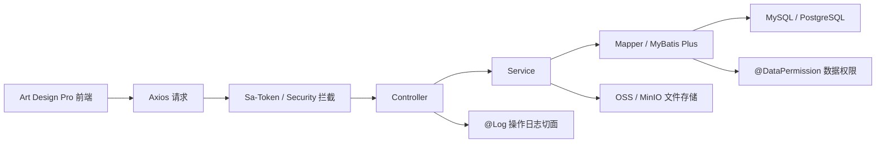
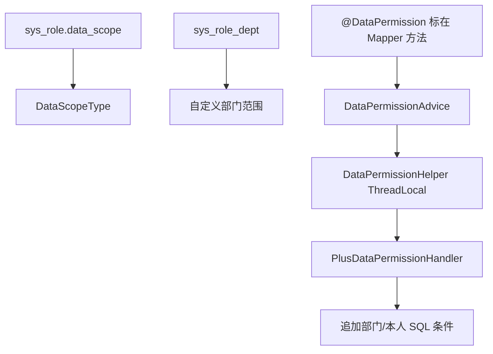

# RuoYi-Vue-Plus Backend Code Reading

本文用于后续建设 `analysis-room-platform` 后端时阅读和参考 RuoYi-Vue-Plus。该仓库只作为权限、安全、日志、数据权限、Excel、文件存储和代码生成器的设计参考，不把源码直接复制进正式项目。

- 参考镜像仓库：https://github.com/l2295992885-svg/ruoyi-vue-plus-reference
- 原始仓库：https://gitee.com/dromara/RuoYi-Vue-Plus.git
- 本地阅读目录：`codex-workspace/RuoYi-Vue-Plus-worktree`
- 抽取范围：`ruoyi-admin`、`ruoyi-common`、`ruoyi-modules`、`script`
- Controller 数量：49
- Controller 接口数量：302

## 1. 总体目录

| 目录 | 作用 | 对本项目的参考方式 |
| --- | --- | --- |
| `ruoyi-admin` | Web 启动入口、登录认证、验证码、首页入口、登录策略和监听器 | 第一阶段重点参考登录、验证码、登录日志、Token 登录态 |
| `ruoyi-common` | 公共能力拆包：core、web、security、satoken、mybatis、log、excel、oss、redis、json、tenant 等 | 只抽取设计思想，正式项目按自己的包结构重建 |
| `ruoyi-modules/ruoyi-system` | 用户、角色、部门、菜单、岗位、字典、参数、通知、客户端、文件、日志、在线用户、租户等系统模块 | 第一阶段重点参考用户、角色、部门、菜单、权限、日志、文件 |
| `ruoyi-modules/ruoyi-generator` | 代码生成器：读取表、维护生成配置、预览、下载生成代码 | 第一阶段可作为后台 CRUD 生成器参考，但不要直接混入 |
| `ruoyi-modules/ruoyi-demo` | Excel、Redis、WebSocket、队列、短信、邮件、加密、限流等演示接口 | 只作为能力样例，不纳入第一阶段业务 |
| `ruoyi-modules/ruoyi-job` | 分布式任务调度相关模块 | 第一阶段不引入 |
| `ruoyi-modules/ruoyi-workflow` | 流程定义、流程实例、流程任务、请假测试流程 | 第一阶段不引入 |
| `ruoyi-extend` | Spring Boot Admin、SnailJob Server 等扩展服务 | 第一阶段不引入 |
| `script` | SQL 初始化、Docker、部署脚本、流程脚本 | 重点参考 `script/sql/ry_vue_5.X.sql` 的权限基础表 |

## 2. 第一阶段参考边界

第一阶段重点参考：

| 能力 | RuoYi 位置 | 本项目落地建议 |
| --- | --- | --- |
| 登录认证 | `ruoyi-admin/.../AuthController.java`、`SysLoginService.java`、各 `*AuthStrategy.java`、`ruoyi-common-satoken` | 先做账号密码登录、退出、当前用户信息；短信/邮箱/社交登录先不做 |
| 用户管理 | `SysUserController`、`SysUserServiceImpl`、`SysUserMapper`、`sys_user` | 建立用户 CRUD、导入导出、重置密码、启停、分配角色 |
| 角色管理 | `SysRoleController`、`SysRoleServiceImpl`、`sys_role`、`sys_role_menu`、`sys_role_dept` | 建立角色 CRUD、菜单授权、数据权限 |
| 部门管理 | `SysDeptController`、`SysDeptServiceImpl`、`sys_dept` | 建立树形部门、部门启停、部门范围校验 |
| 菜单和按钮权限 | `SysMenuController`、`SysMenuServiceImpl`、`sys_menu` | 菜单类型保留目录/菜单/按钮；按钮权限使用 `module:resource:action` |
| 数据权限 | `@DataPermission`、`PlusDataPermissionInterceptor`、`PlusDataPermissionHandler`、`DataScopeType` | 第一阶段只做部门、本部门及以下、本人、自定义部门范围 |
| 登录日志 | `SysLogininforController`、`UserActionListener`、`sys_logininfor` | 登录成功/失败都记录，支持查询、删除、清空、导出、解锁 |
| 操作日志 | `@Log`、`LogAspect`、`SysOperlogController`、`sys_oper_log` | 写操作、导入、导出、授权、生成代码都记录 |
| Excel | `ruoyi-common-excel`、`SysUserController.importData/export`、`TestExcelController` | 用注解驱动字段导出，导入使用 Listener 做校验 |
| 文件上传/OSS/MinIO | `SysOssController`、`SysOssServiceImpl`、`ruoyi-common-oss`、`sys_oss`、`sys_oss_config` | 第一阶段先落地本地/MinIO 二选一，保留统一文件元数据表 |
| 代码生成器 | `GenController`、`gen_table`、`gen_table_column`、`vm` 模板 | 可作为后续内部提效工具，不作为第一批业务依赖 |

第一阶段不建议引入：

| 能力 | 原因 |
| --- | --- |
| 多租户 | 会放大所有表结构、缓存 key、登录上下文和数据权限复杂度 |
| 多数据源 | 会增加事务、代码生成和数据权限复杂度 |
| 复杂工作流 | 当前业务先用待办/审批状态机即可 |
| 分布式任务 | 初期用单体定时任务或手动任务足够 |
| 链路追踪和大规模监控 | 先保留日志字段和健康检查，后续再接入 |
| Demo 模块 | 演示接口过多，容易污染正式业务边界 |

## 3. 后端调用链



关键点：

1. Controller 层使用 `@SaCheckPermission` 做接口权限校验，前端按钮隐藏不能替代后端校验。
2. 写操作通常组合 `@Log` 和 `@RepeatSubmit`，分别解决审计和重复提交。
3. 数据权限不是写在 Controller，而是通过 Mapper 上的 `@DataPermission` 配合 MyBatis 拦截器拼接 SQL。
4. 登录用户上下文通过 `LoginHelper` 从 Sa-Token session 中读取。
5. Excel 导入导出使用 `ExcelUtil`，导出直接写 `HttpServletResponse`。

## 4. 核心表

| 表 | 作用 | 第一阶段建议 |
| --- | --- | --- |
| `sys_user` | 用户信息 | 保留账号、昵称、密码、部门、手机号、邮箱、状态、最后登录信息、审计字段 |
| `sys_role` | 角色信息 | 保留 `role_key`、`data_scope`、状态、审计字段 |
| `sys_menu` | 菜单和按钮权限 | 保留目录/菜单/按钮类型、路由、组件、权限标识、图标、可见状态 |
| `sys_dept` | 部门树 | 保留 `parent_id`、`ancestors`、排序、负责人、状态 |
| `sys_user_role` | 用户和角色 | 多对多 |
| `sys_role_menu` | 角色和菜单 | 多对多 |
| `sys_role_dept` | 角色和自定义数据范围部门 | 数据权限核心 |
| `sys_oper_log` | 操作日志 | 记录模块、业务类型、请求方法、URL、参数、结果、状态、耗时 |
| `sys_logininfor` | 登录日志 | 记录账号、客户端、设备、IP、浏览器、系统、状态、消息、时间 |
| `sys_oss` | 文件元数据 | 文件中心基础表 |
| `sys_oss_config` | 对象存储配置 | 第一阶段可先简化为单一 MinIO 配置 |
| `gen_table` | 代码生成业务表 | 后续内部工具 |
| `gen_table_column` | 代码生成字段表 | 后续内部工具 |

## 5. 数据权限理解

RuoYi 的数据权限链路：



`DataScopeType` 的语义：

| code | 类型 | 含义 |
| --- | --- | --- |
| `1` | ALL | 全部数据权限 |
| `2` | CUSTOM | 自定义部门权限，来源 `sys_role_dept` |
| `3` | DEPT | 本部门 |
| `4` | DEPT_AND_CHILD | 本部门及以下 |
| `5` | SELF | 仅本人 |
| `6` | DEPT_AND_CHILD_OR_SELF | 本部门及以下或本人 |

本项目第一阶段建议：

1. 先实现 `ALL`、`DEPT_AND_CHILD`、`SELF`、`CUSTOM`。
2. 对用户、角色、部门、文件、违章、LKJ 公示等涉及部门归属的数据表统一保留 `dept_id`、`create_by`、`create_time`。
3. Mapper 或查询服务统一声明数据权限，不允许前端传部门 ID 绕过。
4. 超级管理员绕过数据权限，但仍记录操作日志。

## 6. Controller 接口清单

说明：

- `Permission` 为接口上的 `@SaCheckPermission` 或 `@SaCheckRole`。
- `Notes` 中 `log` 表示有 `@Log`，`repeat-submit` 表示有重复提交保护，`rate-limit` 表示有限流。
- Demo、Workflow、Tenant 相关接口列入清单是为了理解仓库，不建议第一阶段引入。

### ruoyi-admin

#### AuthController `/auth`

| HTTP | Path | Handler | Permission | Notes |
| --- | --- | --- | --- | --- |
| POST | `/auth/login` | `login` | `-` | - |
| GET | `/auth/binding/{source}` | `authBinding` | `-` | - |
| POST | `/auth/social/callback` | `socialCallback` | `-` | - |
| DELETE | `/auth/unlock/{socialId}` | `unlockSocial` | `-` | - |
| POST | `/auth/logout` | `logout` | `-` | - |
| POST | `/auth/register` | `register` | `-` | - |
| GET | `/auth/tenant/list` | `tenantList` | `-` | rate-limit |

#### CaptchaController `/`

| HTTP | Path | Handler | Permission | Notes |
| --- | --- | --- | --- | --- |
| GET | `/resource/sms/code` | `smsCode` | `-` | rate-limit |
| GET | `/resource/email/code` | `emailCode` | `-` | - |
| GET | `/auth/code` | `getCode` | `-` | - |

#### IndexController `/`

| HTTP | Path | Handler | Permission | Notes |
| --- | --- | --- | --- | --- |
| GET | `/` | `index` | `-` | - |

### ruoyi-modules/ruoyi-system

#### SysUserController `/system/user`

| HTTP | Path | Handler | Permission | Notes |
| --- | --- | --- | --- | --- |
| GET | `/system/user/list` | `list` | `system:user:list` | - |
| POST | `/system/user/export` | `export` | `system:user:export` | log |
| POST | `/system/user/importData` | `importData` | `system:user:import` | log |
| POST | `/system/user/importTemplate` | `importTemplate` | `-` | - |
| GET | `/system/user/getInfo` | `getInfo` | `-` | - |
| GET | `/system/user/` | `getInfo` | `system:user:query` | - |
| GET | `/system/user/{userId}` | `getInfo` | `system:user:query` | - |
| POST | `/system/user` | `add` | `system:user:add` | log, repeat-submit |
| PUT | `/system/user` | `edit` | `system:user:edit` | log, repeat-submit |
| DELETE | `/system/user/{userIds}` | `remove` | `system:user:remove` | log |
| GET | `/system/user/optionselect` | `optionselect` | `system:user:query` | - |
| PUT | `/system/user/resetPwd` | `resetPwd` | `system:user:resetPwd` | log, repeat-submit |
| PUT | `/system/user/changeStatus` | `changeStatus` | `system:user:edit` | log, repeat-submit |
| GET | `/system/user/authRole/{userId}` | `authRole` | `system:user:query` | - |
| PUT | `/system/user/authRole` | `insertAuthRole` | `system:user:edit` | log, repeat-submit |
| GET | `/system/user/deptTree` | `deptTree` | `system:user:list` | - |
| GET | `/system/user/list/dept/{deptId}` | `listByDept` | `system:user:list` | - |

#### SysRoleController `/system/role`

| HTTP | Path | Handler | Permission | Notes |
| --- | --- | --- | --- | --- |
| GET | `/system/role/list` | `list` | `system:role:list` | - |
| POST | `/system/role/export` | `export` | `system:role:export` | log |
| GET | `/system/role/{roleId}` | `getInfo` | `system:role:query` | - |
| POST | `/system/role` | `add` | `system:role:add` | log, repeat-submit |
| PUT | `/system/role` | `edit` | `system:role:edit` | log, repeat-submit |
| PUT | `/system/role/dataScope` | `dataScope` | `system:role:edit` | log, repeat-submit |
| PUT | `/system/role/changeStatus` | `changeStatus` | `system:role:edit` | log, repeat-submit |
| DELETE | `/system/role/{roleIds}` | `remove` | `system:role:remove` | log |
| GET | `/system/role/optionselect` | `optionselect` | `system:role:query` | - |
| GET | `/system/role/authUser/allocatedList` | `allocatedList` | `system:role:list` | - |
| GET | `/system/role/authUser/unallocatedList` | `unallocatedList` | `system:role:list` | - |
| PUT | `/system/role/authUser/cancel` | `cancelAuthUser` | `system:role:edit` | log, repeat-submit |
| PUT | `/system/role/authUser/cancelAll` | `cancelAuthUserAll` | `system:role:edit` | log, repeat-submit |
| PUT | `/system/role/authUser/selectAll` | `selectAuthUserAll` | `system:role:edit` | log, repeat-submit |
| GET | `/system/role/deptTree/{roleId}` | `roleDeptTreeselect` | `system:role:list` | - |

#### SysDeptController `/system/dept`

| HTTP | Path | Handler | Permission | Notes |
| --- | --- | --- | --- | --- |
| GET | `/system/dept/list` | `list` | `system:dept:list` | - |
| GET | `/system/dept/list/exclude/{deptId}` | `excludeChild` | `system:dept:list` | - |
| GET | `/system/dept/{deptId}` | `getInfo` | `system:dept:query` | - |
| POST | `/system/dept` | `add` | `system:dept:add` | log, repeat-submit |
| PUT | `/system/dept` | `edit` | `system:dept:edit` | log, repeat-submit |
| DELETE | `/system/dept/{deptId}` | `remove` | `system:dept:remove` | log |
| GET | `/system/dept/optionselect` | `optionselect` | `system:dept:query` | - |

#### SysMenuController `/system/menu`

| HTTP | Path | Handler | Permission | Notes |
| --- | --- | --- | --- | --- |
| GET | `/system/menu/getRouters` | `getRouters` | `-` | - |
| GET | `/system/menu/list` | `list` | `system:menu:list` | - |
| GET | `/system/menu/{menuId}` | `getInfo` | `system:menu:query` | - |
| GET | `/system/menu/treeselect` | `treeselect` | `system:menu:query` | - |
| GET | `/system/menu/roleMenuTreeselect/{roleId}` | `roleMenuTreeselect` | `system:menu:query` | - |
| GET | `/system/menu/tenantPackageMenuTreeselect/{packageId}` | `tenantPackageMenuTreeselect` | `system:menu:query` | - |
| POST | `/system/menu` | `add` | `system:menu:add` | log, repeat-submit |
| PUT | `/system/menu` | `edit` | `system:menu:edit` | log, repeat-submit |
| DELETE | `/system/menu/{menuId}` | `remove` | `system:menu:remove` | log |
| DELETE | `/system/menu/cascade/{menuIds}` | `remove` | `system:menu:remove` | log |

#### SysOssController `/resource/oss`

| HTTP | Path | Handler | Permission | Notes |
| --- | --- | --- | --- | --- |
| GET | `/resource/oss/list` | `list` | `system:oss:list` | - |
| GET | `/resource/oss/listByIds/{ossIds}` | `listByIds` | `system:oss:query` | - |
| POST | `/resource/oss/upload` | `upload` | `system:oss:upload` | log |
| GET | `/resource/oss/download/{ossId}` | `download` | `system:oss:download` | - |
| DELETE | `/resource/oss/{ossIds}` | `remove` | `system:oss:remove` | log |

#### SysOssConfigController `/resource/oss/config`

| HTTP | Path | Handler | Permission | Notes |
| --- | --- | --- | --- | --- |
| GET | `/resource/oss/config/list` | `list` | `system:ossConfig:list` | - |
| GET | `/resource/oss/config/{ossConfigId}` | `getInfo` | `system:ossConfig:list` | - |
| POST | `/resource/oss/config` | `add` | `system:ossConfig:add` | log, repeat-submit |
| PUT | `/resource/oss/config` | `edit` | `system:ossConfig:edit` | log, repeat-submit |
| DELETE | `/resource/oss/config/{ossConfigIds}` | `remove` | `system:ossConfig:remove` | log |
| PUT | `/resource/oss/config/changeStatus` | `changeStatus` | `system:ossConfig:edit` | log, repeat-submit |

#### SysLogininforController `/monitor/logininfor`

| HTTP | Path | Handler | Permission | Notes |
| --- | --- | --- | --- | --- |
| GET | `/monitor/logininfor/list` | `list` | `monitor:logininfor:list` | - |
| POST | `/monitor/logininfor/export` | `export` | `monitor:logininfor:export` | log |
| DELETE | `/monitor/logininfor/{infoIds}` | `remove` | `monitor:logininfor:remove` | log |
| DELETE | `/monitor/logininfor/clean` | `clean` | `monitor:logininfor:remove` | log |
| GET | `/monitor/logininfor/unlock/{userName}` | `unlock` | `monitor:logininfor:unlock` | log, repeat-submit |

#### SysOperlogController `/monitor/operlog`

| HTTP | Path | Handler | Permission | Notes |
| --- | --- | --- | --- | --- |
| GET | `/monitor/operlog/list` | `list` | `monitor:operlog:list` | - |
| POST | `/monitor/operlog/export` | `export` | `monitor:operlog:export` | log |
| DELETE | `/monitor/operlog/{operIds}` | `remove` | `monitor:operlog:remove` | log |
| DELETE | `/monitor/operlog/clean` | `clean` | `monitor:operlog:remove` | log |

#### Other system controllers

| Controller | Base path | Endpoint summary | First-stage decision |
| --- | --- | --- | --- |
| `SysPostController` | `/system/post` | list/export/detail/add/edit/delete/optionselect/deptTree | 可参考岗位/工种，但不是第一批核心 |
| `SysDictTypeController` | `/system/dict/type` | list/export/detail/add/edit/delete/refreshCache/optionselect | 建议第一阶段保留字典能力 |
| `SysDictDataController` | `/system/dict/data` | list/export/detail/byType/add/edit/delete | 建议第一阶段保留字典能力 |
| `SysConfigController` | `/system/config` | list/export/detail/byKey/add/edit/updateByKey/delete/refreshCache | 可简化保留系统参数 |
| `SysNoticeController` | `/system/notice` | list/detail/add/edit/delete | 可作为信箱/公告参考 |
| `SysProfileController` | `/system/user/profile` | profile/updateProfile/updatePwd/avatar | 必须保留个人中心和头像上传 |
| `SysUserOnlineController` | `/monitor/online` | list/forceLogout/current/removeOwn | 可后置 |
| `CacheController` | `/monitor/cache` | getInfo | 可后置 |
| `SysClientController` | `/system/client` | list/export/detail/add/edit/changeStatus/delete | 多客户端认证可后置 |
| `SysSocialController` | `/system/social` | list | 社交登录后置 |
| `SysTenantController` | `/system/tenant` | tenant CRUD、动态租户、同步租户字典配置 | 第一阶段不引入 |
| `SysTenantPackageController` | `/system/tenant/package` | package CRUD、selectList | 第一阶段不引入 |

### ruoyi-modules/ruoyi-generator

#### GenController `/tool/gen`

| HTTP | Path | Handler | Permission | Notes |
| --- | --- | --- | --- | --- |
| GET | `/tool/gen/list` | `genList` | `tool:gen:list` | - |
| GET | `/tool/gen/{tableId}` | `getInfo` | `tool:gen:query` | repeat-submit |
| GET | `/tool/gen/db/list` | `dataList` | `tool:gen:list` | - |
| GET | `/tool/gen/column/{tableId}` | `columnList` | `tool:gen:list` | - |
| POST | `/tool/gen/importTable` | `importTableSave` | `tool:gen:import` | log, repeat-submit |
| PUT | `/tool/gen` | `editSave` | `tool:gen:edit` | log, repeat-submit |
| DELETE | `/tool/gen/{tableIds}` | `remove` | `tool:gen:remove` | log |
| GET | `/tool/gen/preview/{tableId}` | `preview` | `tool:gen:preview` | - |
| GET | `/tool/gen/download/{tableId}` | `download` | `tool:gen:code` | log |
| GET | `/tool/gen/synchDb/{tableId}` | `synchDb` | `tool:gen:edit` | log |
| GET | `/tool/gen/batchGenCode` | `batchGenCode` | `tool:gen:code` | log |
| GET | `/tool/gen/getDataNames` | `getCurrentDataSourceNameList` | `tool:gen:list` | - |

### ruoyi-modules/ruoyi-demo

Demo 模块不是正式业务，只用于理解某些成熟能力。接口按 Controller 归类如下：

| Controller | Base path | 接口 |
| --- | --- | --- |
| `TestDemoController` | `/demo/demo` | `GET /list`、`GET /page`、`POST /importData`、`POST /export`、`GET /{id}`、`POST /`、`PUT /`、`DELETE /{ids}` |
| `TestTreeController` | `/demo/tree` | `GET /list`、`GET /export`、`GET /{id}`、`POST /`、`PUT /`、`DELETE /{ids}` |
| `TestExcelController` | `/demo/excel` | `GET /exportTemplateOne`、`GET /exportTemplateMuliti`、`GET /exportWithOptions`、`GET /customExport`、`GET /exportTemplateMultiSheet`、`POST /importWithOptions` |
| `SaTokenTestController` | `/demo/saTokenDoc` | 登录、角色、权限、通配符、临时权限等 16 个权限演示接口 |
| `RedisRateLimiterController` | `/demo/rateLimiter` | `GET /test`、`/testip`、`/testcluster`、`/testObj` |
| `RedisCacheController` | `/demo/cache` | `GET /test1`、`/test2`、`/test3`、`/test6` |
| `RedisLockController` | `/demo/redisLock` | `GET /testLock4j`、`/testLock4jLockTemplate` |
| `RedisPubSubController` | `/demo/redis/pubsub` | `GET /pub`、`GET /sub` |
| `MailSendController` | `/demo/mail` | `GET /sendSimpleMessage`、`/sendMessageWithAttachment`、`/sendMessageWithAttachments` |
| `SmsController` | `/demo/sms` | `GET /sendAliyun`、`/sendTencent`、`/addBlacklist`、`/removeBlacklist` |
| `WebSocketController` | `/demo/websocket` | `GET /send` |
| Queue controllers | `/demo/queue/*` | bounded、delayed、priority 队列演示 |
| Other demo controllers | `/swagger/demo`、`/demo/encrypt`、`/demo/i18n`、`/demo/sensitive`、`/demo/batch` | 上传、加密、国际化、脱敏、批处理演示 |

### ruoyi-modules/ruoyi-workflow

Workflow 第一阶段不引入。接口用于理解流程系统边界：

| Controller | Base path | 接口范围 |
| --- | --- | --- |
| `FlwCategoryController` | `/workflow/category` | 分类 list/export/detail/add/edit/delete/tree |
| `FlwDefinitionController` | `/workflow/definition` | 流程定义 list/unPublish/detail/add/edit/publish/unPublish/delete/copy/import/export/xml/active |
| `FlwInstanceController` | `/workflow/instance` | 运行中/已完成实例、详情、删除、取消、激活、变量、历史任务、作废 |
| `FlwTaskController` | `/workflow/task` | 启动、完成、待办、已办、全部待办、抄送、任务详情、下一节点、终止、驳回、催办 |
| `FlwSpelController` | `/workflow/spel` | SpEL 表达式 list/detail/add/edit/delete |
| `TestLeaveController` | `/workflow/leave` | 请假测试业务 list/export/detail/add/submitAndFlowStart/edit/delete |

## 7. 对 `analysis-room-platform` 的后端初始化建议

建议初始后端目录：

```text
backend/
  analysis-admin/
  analysis-common/
    common-core/
    common-web/
    common-security/
    common-mybatis/
    common-log/
    common-excel/
    common-file/
  analysis-modules/
    analysis-system/
    analysis-file/
    analysis-mailbox/
    analysis-todo/
    analysis-chat/
    analysis-violation/
    analysis-lkj/
```

第一阶段优先落地顺序：

1. `analysis-common`：统一响应、异常、分页、审计字段、Token 工具、日志注解。
2. `analysis-system`：用户、角色、部门、菜单、按钮权限、字典、参数。
3. `analysis-file`：文件元数据、上传、下载、删除、预览地址。
4. `analysis-log` 能力内置到 common/system：登录日志、操作日志。
5. `analysis-lkj`：每日 LKJ 音视频违标公示，必须复用权限、日志、Excel、文件能力。

## 8. 后续 Codex 阅读规则

后续让 Codex 参考 RuoYi 时，建议明确说：

```text
请参考 ruoyi-vue-plus-reference 的设计，但不要复制源码。
重点看 SysUserController、SysRoleController、SysDeptController、SysMenuController、
SysOssController、SysLogininforController、SysOperlogController、GenController、
DataPermission、Log、ExcelUtil、OssService 的设计边界。
```

每次实现业务模块前，先做这三个对照：

1. 该模块是否需要 `@SaCheckPermission` 权限码。
2. 该模块是否需要 `@Log` 操作日志。
3. 该模块是否需要数据权限字段 `dept_id/create_by`。
